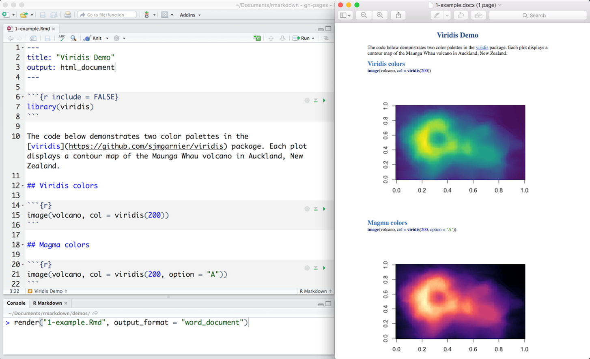
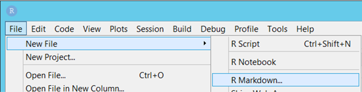
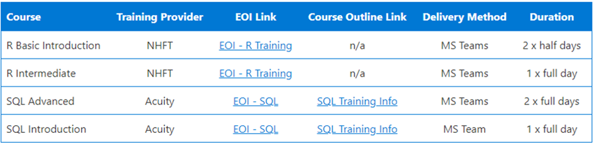

```{r setup, include=FALSE}

library(tidyverse)
library(readxl)
library(networkD3)
library(leaflet)
library(tidygeocoder)
library(rpivotTable)
library(NHSRdatasets)

source("../SMT_dental_slides/03 SMT_plot_functions.R")
source("../SMT_dental_slides/02 format_SMT_data.R")
source("../UEC_sankey_slide/UEC_sankey.R")
#load in raw data
UDA_calendar_data <- read_excel("../data/UDA_calendar_data.xlsx")
UDA_scheduled_data <- read_excel("../data/UDA_scheduled_data.xlsx")
UDA_calendar_data <- rename(UDA_calendar_data, month = data_month)
UDA_scheduled_data <- rename(UDA_scheduled_data, month = data_month)
contractor_categories <- readRDS("../data/contractor_categories.RDS")
prototype_contracts <- read_excel("../data/prototype_contracts.xlsx")

sankey_data <- read_excel("../data/sankey_data.xlsx")
sankey_grouped <- readRDS("../data/sankey_grouped.rds")

data <- ae_attendances
AE_data <- data %>% filter (org_code %in% c("RK9", "RWJ", "AD913"))

knitr::opts_chunk$set(echo = FALSE, warning = FALSE, message = FALSE)

#avoid standard form
options(scipen=999)

```

name: agenda

### Agenda  

 <font size="5">
 + [What is R and R Markdown](#what-is-r)
 + [What are the benefits](#benefits)
 + [Real examples](#real-examples)
 + [Additional functionality](#additional-functionality)
 + [Resources](#resources)
 + Q&A


<font size="2">
#### NOTE 
This is an interactive markdown report.  You can navigate from slide to slide by either clicking the mouse on the screen or by using the cursor keys.  **Press ? for help.** 
Some pages have selection buttons across regions, click on the region in order to explore the data for that area.  
This format also works on mobile devices in browser with no further software required, but has been optimised for 16:9 screen ratio.

---
name: what-is-r
### What is R and RMarkdown?

```{r out.width='75%', fig.align="center"}

```

<font size="2">
[Back to agenda](#agenda)

---
name: r-and-rmarkdown
### R and RMarkdown

.pull-left[
#### R

+ **What?** – R is an open-source programming language
+ **Where?** – Data science server – R studio

```{r out.width='8%', fig.align="centre"}

```

+ **Why?** – Useful for statistics, data manipulation, analysis and visualisation.
+ **Why again?** – reproducible, transparent and scalable

]

.pull-right[
#### RMarkdown

+ **What?** – R markdown is a 'markup' variant of R
+ **Where?** – Data science server – R studio

```{r out.width='65%', fig.align="centre"}

```

+ **Why?** – An easy-to-read file incorporating text, images, headers, download links, buttons etc...

]

<font size="2">
[Back to agenda](#agenda)

---
name: benefits
### Benefits

```{r out.width='85%', fig.align="center"}
knitr::include_graphics("rmarkdown_figures/benefits.png")
```

<font size="2">
[Back to agenda](#agenda)

---
name: real-examples
### Real example: SMT Dental Pack

```{r xaringan-panelset-UDA-activity, echo=FALSE}
xaringanExtra::use_panelset()
```
 <font size="2">
.panelset[

.panel[.panel-name[National]
```{r UDA_activity_Calendar1, echo = FALSE, warning = FALSE, message = FALSE, fig.width=14, fig.height=5, fig.align='center'}
plot_UDA_UOA_delivery_calendar(data = UDA_calendar_data, 
                                  scheduled_data = UDA_scheduled_data,
                                  contractor_cats = contractor_categories,
                                  UDAorUOA = "UDA",
                                  level = "National",
                                  region_STP_name = NULL,
                                  remove_prototypes = T,
                                  regional_lines = F, 
                                  STP_lines = F,
                                  cat_lines = F,
                                  plotChart = T)
```

* This graph shows the average monthly performance of the **`r get_num_contracts(level = "National", region_STP_name = NULL)`** GDS/PDS/PDS+ contracts scaled up by 12 months measured against the delivery thresholds (60% for Apr-Sep 21, 65% for Oct-Dec, 85% for Jan-Mar and 95% for Apr-Jun 22).
* N.B. Previous month's delivery may be marginally higher to what was reported last month
due to the nature of calendar data (see slide 3). This month's figure is likely to be under-reported. 

]
.panel[.panel-name[South East]
```{r UDA_activity_Calendar2, echo = FALSE, warning = FALSE, message = FALSE, fig.width=14, fig.height=5, fig.align='center'}
plot_UDA_UOA_delivery_calendar(data = UDA_calendar_data, 
                                  scheduled_data = UDA_scheduled_data,
                                  contractor_cats = contractor_categories,
                                  UDAorUOA = "UDA",
                                  level = "Regional",
                                  region_STP_name = "South East",
                                  remove_prototypes = T,
                                  regional_lines = F, 
                                  STP_lines = F,
                                  cat_lines = F,
                                  plotChart = T)
```

* This graph shows the average monthly performance of the **`r get_num_contracts(level = "Regional", region_STP_name = "South East")`** GDS/PDS/PDS+ contracts scaled up by 12 months measured against the delivery thresholds (60% for Apr-Sep 21, 65% for Oct-Dec, 85% for Jan-Mar and 95% for Apr-Jun 22).
* N.B. Previous month's delivery may be marginally higher to what was reported last month
due to the nature of calendar data (see slide 3). This month's figure is likely to be under-reported. 

]
.panel[.panel-name[South West]
```{r UDA_activity_Calendar3, echo = FALSE, warning = FALSE, message = FALSE, fig.width=14, fig.height=5, fig.align='center'}
plot_UDA_UOA_delivery_calendar(data = UDA_calendar_data, 
                                  scheduled_data = UDA_scheduled_data,
                                  contractor_cats = contractor_categories,
                                  UDAorUOA = "UDA",
                                  level = "Regional",
                                  region_STP_name = "South West",
                                  remove_prototypes = T,
                                  regional_lines = F, 
                                  STP_lines = F,
                                  cat_lines = F,
                                  plotChart = T)
```

* This graph shows the average monthly performance of the **`r get_num_contracts(level = "Regional", region_STP_name = "South West")`** GDS/PDS/PDS+ contracts scaled up by 12 months measured against the delivery thresholds (60% for Apr-Sep 21, 65% for Oct-Dec, 85% for Jan-Mar and 95% for Apr-Jun 22).
* N.B. Previous month's delivery may be marginally higher to what was reported last month
due to the nature of calendar data (see slide 3). This month's figure is likely to be under-reported. 

]
.panel[.panel-name[North West]
```{r UDA_activity_Calendar4, echo = FALSE, warning = FALSE, message = FALSE, fig.width=14, fig.height=5, fig.align='center'}
plot_UDA_UOA_delivery_calendar(data = UDA_calendar_data, 
                                  scheduled_data = UDA_scheduled_data,
                                  contractor_cats = contractor_categories,
                                  UDAorUOA = "UDA",
                                  level = "Regional",
                                  region_STP_name = "North West",
                                  remove_prototypes = T,
                                  regional_lines = F, 
                                  STP_lines = F,
                                  cat_lines = F,
                                  plotChart = T)
```

* This graph shows the average monthly performance of the **`r get_num_contracts(level = "Regional", region_STP_name = "North West")`** GDS/PDS/PDS+ contracts scaled up by 12 months measured against the delivery thresholds (60% for Apr-Sep 21, 65% for Oct-Dec, 85% for Jan-Mar and 95% for Apr-Jun 22).
* N.B. Previous month's delivery may be marginally higher to what was reported last month
due to the nature of calendar data (see slide 3). This month's figure is likely to be under-reported. 

]
.panel[.panel-name[North East and Yorkshire]
```{r UDA_activity_Calendar5, echo = FALSE, warning = FALSE, message = FALSE, fig.width=14, fig.height=5, fig.align='center'}
plot_UDA_UOA_delivery_calendar(data = UDA_calendar_data, 
                                  scheduled_data = UDA_scheduled_data,
                                  contractor_cats = contractor_categories,
                                  UDAorUOA = "UDA",
                                  level = "Regional",
                                  region_STP_name = "North East and Yorkshire",
                                  remove_prototypes = T,
                                  regional_lines = F, 
                                  STP_lines = F,
                                  cat_lines = F,
                                  plotChart = T)
```

* This graph shows the average monthly performance of the **`r get_num_contracts(level = "Regional", region_STP_name = "North East and Yorkshire")`** GDS/PDS/PDS+ contracts scaled up by 12 months measured against the delivery thresholds (60% for Apr-Sep 21, 65% for Oct-Dec, 85% for Jan-Mar and 95% for Apr-Jun 22).
* N.B. Previous month's delivery may be marginally higher to what was reported last month
due to the nature of calendar data (see slide 3). This month's figure is likely to be under-reported. 

]
.panel[.panel-name[London]
```{r UDA_activity_Calendar6, echo = FALSE, warning = FALSE, message = FALSE, fig.width=14, fig.height=5, fig.align='center'}
plot_UDA_UOA_delivery_calendar(data = UDA_calendar_data, 
                                  scheduled_data = UDA_scheduled_data,
                                  contractor_cats = contractor_categories,
                                  UDAorUOA = "UDA",
                                  level = "Regional",
                                  region_STP_name = "London",
                                  remove_prototypes = T,
                                  regional_lines = F, 
                                  STP_lines = F,
                                  cat_lines = F,
                                  plotChart = T)
```

* This graph shows the average monthly performance of the **`r get_num_contracts(level = "Regional", region_STP_name = "London")`** GDS/PDS/PDS+ contracts scaled up by 12 months measured against the delivery thresholds (60% for Apr-Sep 21, 65% for Oct-Dec, 85% for Jan-Mar and 95% for Apr-Jun 22).
* N.B. Previous month's delivery may be marginally higher to what was reported last month
due to the nature of calendar data (see slide 3). This month's figure is likely to be under-reported. 

]
.panel[.panel-name[Midlands]
```{r UDA_activity_Calendar7, echo = FALSE, warning = FALSE, message = FALSE, fig.width=14, fig.height=5, fig.align='center'}
plot_UDA_UOA_delivery_calendar(data = UDA_calendar_data, 
                                  scheduled_data = UDA_scheduled_data,
                                  contractor_cats = contractor_categories,
                                  UDAorUOA = "UDA",
                                  level = "Regional",
                                  region_STP_name = "Midlands",
                                  remove_prototypes = T,
                                  regional_lines = F, 
                                  STP_lines = F,
                                  cat_lines = F,
                                  plotChart = T)
```

* This graph shows the average monthly performance of the **`r get_num_contracts(level = "Regional", region_STP_name = "Midlands")`** GDS/PDS/PDS+ contracts scaled up by 12 months measured against the delivery thresholds (60% for Apr-Sep 21, 65% for Oct-Dec, 85% for Jan-Mar and 95% for Apr-Jun 22).
* N.B. Previous month's delivery may be marginally higher to what was reported last month
due to the nature of calendar data (see slide 3). This month's figure is likely to be under-reported. 

]
.panel[.panel-name[East of England]
```{r UDA_activity_Calendar8, echo = FALSE, warning = FALSE, message = FALSE, fig.width=14, fig.height=5, fig.align='center'}
plot_UDA_UOA_delivery_calendar(data = UDA_calendar_data, 
                                  scheduled_data = UDA_scheduled_data,
                                  contractor_cats = contractor_categories,
                                  UDAorUOA = "UDA",
                                  level = "Region",
                                  region_STP_name = "East of England",
                                  remove_prototypes = T,
                                  regional_lines = F, 
                                  STP_lines = F,
                                  cat_lines = F,
                                  plotChart = T)
```

* This graph shows the average monthly performance of the **`r get_num_contracts(level = "Regional", region_STP_name = "East of England")`** GDS/PDS/PDS+ contracts scaled up by 12 months measured against the delivery thresholds (60% for Apr-Sep 21, 65% for Oct-Dec, 85% for Jan-Mar and 95% for Apr-Jun 22).
* N.B. Previous month's delivery may be marginally higher to what was reported last month
due to the nature of calendar data (see slide 3). This month's figure is likely to be under-reported. 

]
.panel[.panel-name[All]
```{r UDA_activity_Calendar9, echo = FALSE, warning = FALSE, message = FALSE, fig.width=14, fig.height=5, fig.align='center'}
plot_UDA_UOA_delivery_calendar(data = UDA_calendar_data,
                                  scheduled_data = UDA_scheduled_data,
                                  contractor_cats = contractor_categories,
                                  UDAorUOA = "UDA",
                                  level = "National",
                                  region_STP_name = NULL,
                                  remove_prototypes = T,
                                  regional_lines = T,
                                  STP_lines = F,
                                  cat_lines = F,
                                  plotChart = T)
```

]
.panel[.panel-name[National level data]
```{r echo=FALSE, results='asis',warning=FALSE, fig.width=3, fig.height=3}

DT::datatable(plot_UDA_UOA_delivery_calendar(data = UDA_calendar_data, 
                                  scheduled_data = UDA_scheduled_data,
                                  contractor_cats = contractor_categories,
                                  UDAorUOA = "UDA",
                                  level = "National",
                                  region_STP_name = NULL,
                                  remove_prototypes = T,
                                  regional_lines = F, 
                                  STP_lines = F,
                                  cat_lines = F,
                                  plotChart = F),
              rownames=FALSE,  extensions = 'Buttons', options = list(dom='Bt', buttons = c('excel'),
  bPaginate = FALSE, pageLength=35, columnDefs = list(list(className = 'dt-left', targets = 0:4)),searching=FALSE,scrollY ='350px', scrollX ='500px'))%>%
  DT::formatStyle(columns = 1:5, fontSize = '90%')
```
]
]


<font size="2">
[Back to agenda](#agenda)

---
name: real-example2
### Real example: UEC CPCS


```{r UEC-sankeys, echo=FALSE}
xaringanExtra::use_panelset()
```
 <font size="2">
.panelset[

.panel[.panel-name[High level]
```{r sankey1, echo = FALSE, warning = FALSE, message = FALSE, fig.align='center'}
plot_UEC_CPCS_sankey_grouped()
```


]
.panel[.panel-name[Detail]
```{r sankey2, echo = FALSE, warning = FALSE, message = FALSE, fig.align='center'}
plot_UEC_CPCS_sankey()
```


]
]

<font size="2">
[Back to agenda](#agenda)

---
name: additional-functionality
### Additional functionality: Maps

<!-- # ```{r out.width='60%', fig.align="center"} -->
<!-- # knitr::include_graphics("https://media.giphy.com/media/SRwmnX3tGw4pqMXJKS/giphy.gif") -->
<!-- # ``` -->

```{r mappymcmapface}

## creates a basic dataframe with some teams and postcodes
label <- c('Team A', 'Team A', 'Team B', 'Team B', 'Team C')
postcode <- c('EX16 7FL', 'EX39 5EN', 'PL13 2WP', 'PL15 8RZ', 'PL30 4PX')
df <- data.frame(label,postcode)

## This is the magic bit that uses the tidygeocoder package to find longatudes and latitudes
df <- df %>% mutate( geo(address = df$postcode, method = 'osm'))

## Filters cohort into three lists, one for each iconset
cohort_filter1 <- df %>%
  filter(df$label == "Team A")
cohort_filter2 <- df %>%
  filter(df$label == "Team B")
cohort_filter3 <- df %>%
  filter(df$label == "Team C")

##  Create awesome icon sets for colours
iconSet <- awesomeIconList(
  "Team A"  = makeAwesomeIcon( icon = 'male', lib = 'fa', iconColor = "black", markerColor = "red"   , spin = FALSE ) ,
  "Team B"             = makeAwesomeIcon( icon = 'male', lib = 'fa', iconColor = "black", markerColor = "orange", spin = FALSE ) ,
  "Team C"       = makeAwesomeIcon( icon = 'male', lib = 'fa', iconColor = "black", markerColor = "beige" , spin = FALSE ) )

## Creates layors for map, each for the three iconset 'Teams'
map <- leaflet(df) %>%  
  addTiles() %>%
  addProviderTiles(providers$OpenStreetMap) %>% 
  addAwesomeMarkers( lng = cohort_filter1$long,
                     lat = cohort_filter1$lat,
                     group = "Team A",
                     icon = iconSet[cohort_filter1$label],
                     label = paste(sep = " - ",
                                   cohort_filter1$label ) ) %>%
  addAwesomeMarkers( lng = cohort_filter2$long,
                     lat = cohort_filter2$lat,
                     group = "Team B",
                     icon = iconSet[cohort_filter2$label],
                     label = paste(sep = " - ",
                                   cohort_filter2$label ) ) %>%
  addAwesomeMarkers( lng = cohort_filter3$long,
                     lat = cohort_filter3$lat,
                     group = "Team C",
                     icon = iconSet[cohort_filter3$label],
                     label = paste(sep = " - ",
                                   cohort_filter3$label ) ) %>% 
  addLayersControl(overlayGroups = c("Team A", "Team B", "Team C"),    ##this bit adds the controls
    options = layersControlOptions(collapsed = FALSE) ) 

map

```


<font size="2">
[Back to agenda](#agenda)

---

### Additional functionality: Pivot tables

```{r pivottable}
rpivotTable(AE_data,rows=c("org_code"), cols=c("type"), vals=c("admissions"),width="100%", height="1200px")
```

<font size="2">
[Back to agenda](#agenda)

---

name: resources
### Resources

 <font size="3">
 Links to additional resources:

[Course-led training](https://nhsengland.sharepoint.com/teams/AnalyticalLearningandDevelopment/SitePages/Upcoming-Events.aspx)

```{r out.width='60%', fig.align="center"}

```

[Self-led](https://future.nhs.uk/system/login?nextURL=%2Fconnect%2Eti%2FDataAnalytics%2Fview%3FobjectId%3D22827888#22827888)

[Get started straight away](https://philosopher-analyst.netlify.app/rmd-workshop/)

[RMarkdown Cheat Sheet](https://www.rstudio.com/wp-content/uploads/2015/02/rmarkdown-cheatsheet.pdf)

[How to set up and start using github](https://docs.github.com/en/get-started/quickstart/hello-world)

[Basic GitHub guide created for PhODs team](https://nhsengland.sharepoint.com/:p:/r/sites/PrimaryCareCollaborations-PCSCAnalystsVirtualTeam/Shared%20Documents/PCSC%20Analysts%20Virtual%20Team/Skills%20Exchange%20Recordings/Rmarkdown%2020May2022/Github%20Workflow%20for%20PhODs%20Team%20v2.pptx?d=w285cc638be3b4f9e9fa234f171c1d4d6&csf=1&web=1&e=g943pT)

[The code for this report](https://github.com/ImogenConnorHelleur/Rmarkdown-showcase)


